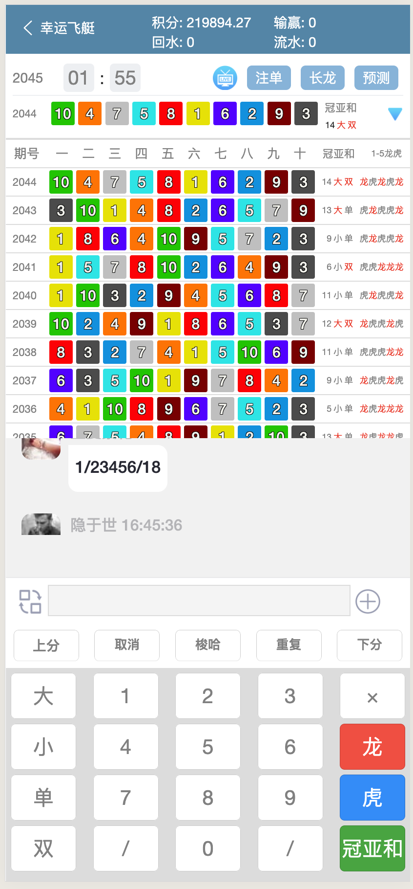
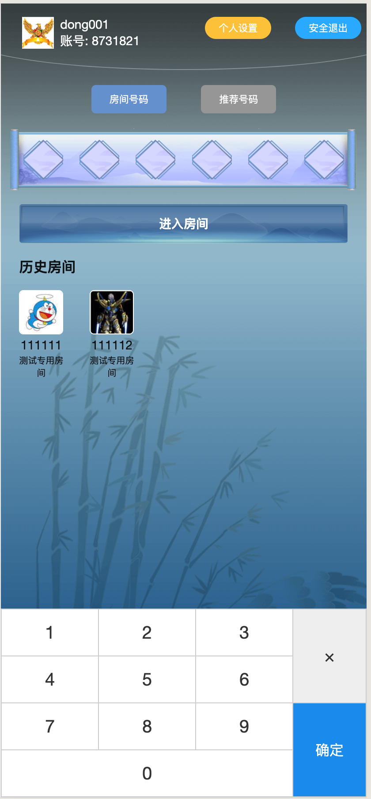
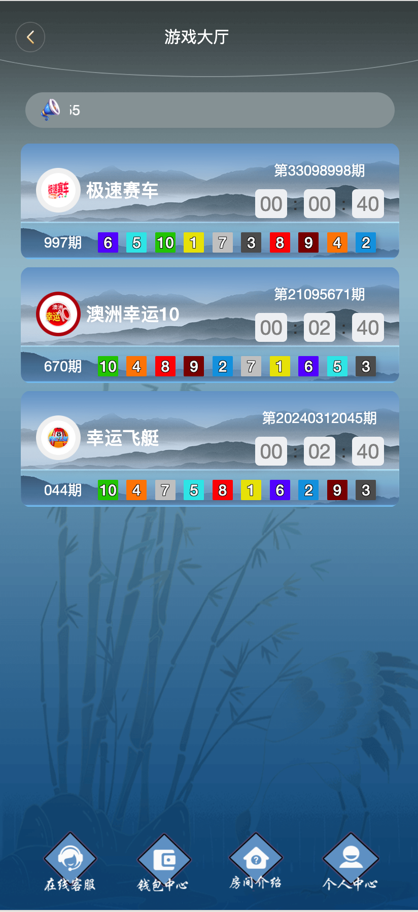
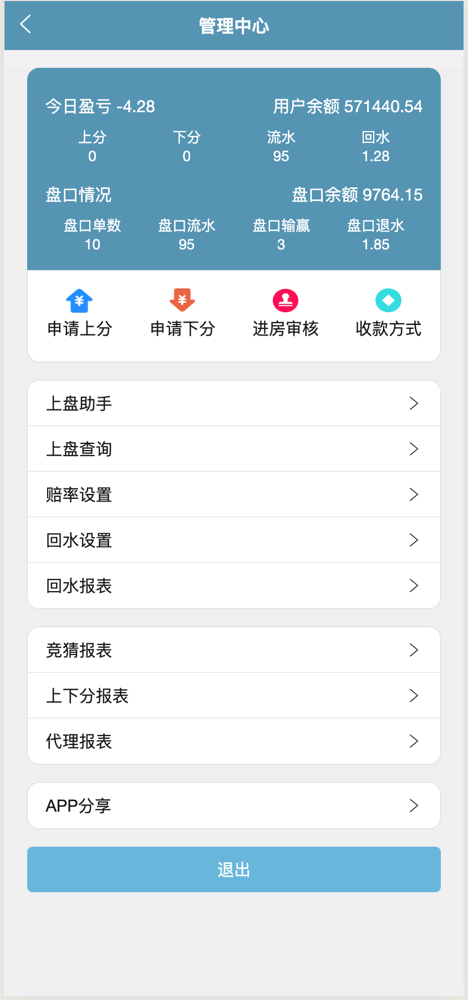

#  Pk10投注平台

### 项目介绍

PK10 是一种基于北京赛车比赛结果的彩票游戏。玩家通过预测赛车比赛的结果来下注，包括哪辆车赢得比赛、排名顺序等。包括极速赛车，幸运飞艇等。

游戏用户通过自定义键盘, 输入特定指令字符, 进行积分投注游戏的一款App, 采用uni-app框架开发, 简单快捷的即可发布运行在三端 ( iOS、Android、h5 )。




### 目录

1. 背景
2. 功能
3. 安装
4. 使用方法
5. 目录结构
6. 开发计划
7. 许可证
8. 联系方式
9. 致谢

### 背景


通常 PK10 玩家都是使用 PC 网页所提供的投注规则在网页上进行点击特定的游戏规则完成特定投注，但是这样带来的一个弊端是无法在短时间内快速点击多种投注类型组合完成多种组合类型的投注。为了解决该问题，能让用户在移动端通过自定义的键盘组合，随时随地的下注。

### 功能


- 通房间号码, 进入不同的房间进行游戏

  

  

- 游戏大厅, 可选择不同游戏, 进行积分投注

  

  

- 钱包中心, 玩家账户余额、游戏记录,、 积分统计记录等功能

  


### 安装

克隆项目

git clone

安装依赖 npm install

### 使用方法


运行环境

HBuilderX 开发工具

本地开发 启动项目

1. 点击运行Chrome, 运行H5页面
2. 点击运行Android基座, 并连接手机, 真机运行安卓App
3. 点击运行ios基座, 并连接手机, 真机运行苹果App ( 注意: 需要苹果App,开发者证书 )


### 目录结构


```
├── common                     # 公共Js方法函数
 		├── api                    # 所有请求
├── components                 # 页面公共组件
├── sockjs                     # webSock通讯依赖js
│   │── stomp.js            	 # stomp代理插件js
│   └── websocket-uni          # nuiappp原生websocket库
├── pages                      # 页面源代码
│   ├── applyRecord            # 上下分记录
│   ├── contestList            # 竞猜报表
│   ├── gameBet        				 # 游戏房间
│   ├── gameIntroduce          # 房间介绍
│   ├── gameRecord             # 游戏记录
│   ├── home                   # 首页
│   ├── index                  # 游戏大厅
│   ├── individual             # 个人中心
│   ├── integralList           # 积分账变
│   ├── login                  # 登入
│   ├── walletCenter           # 钱包中心
│   └── welfareList            # 福利报表
├── static                     # 全局静态图片/css资源
├── store                  		 # 全局 store管理
├── utils                      # 全局公用方法
├── App.vue                    # 入口页面
├── main.js                    # 入口文件 加载组件 初始化等
├── manifest.json              # 应用配置
├── pages.json                 # 页面配置
├── uni.scss                   # 全局样式
├── package-lock.json          # package-loc.json
└── package.json               # package.json
```


### 开发计划


- 已完成的功能
  - PK10 投注系统
- 待开发的功能1
  - 马克 6 的接入（香港六合彩与澳门六合彩）
  - 时时彩接入
  - 
- 待开发的功能2
  - 加密货币换算成系统积分的交易系统

### 许可证

此项目根据 MIT License 授权

### 联系方式

目前有移动用户端以及移动用户管理端，可上盘，同时也有上盘管理系统以及上盘报表和上盘用户管理。如果有需要请通过邮件联系。

邮箱: dongsir06@gmail.com

### 致谢

